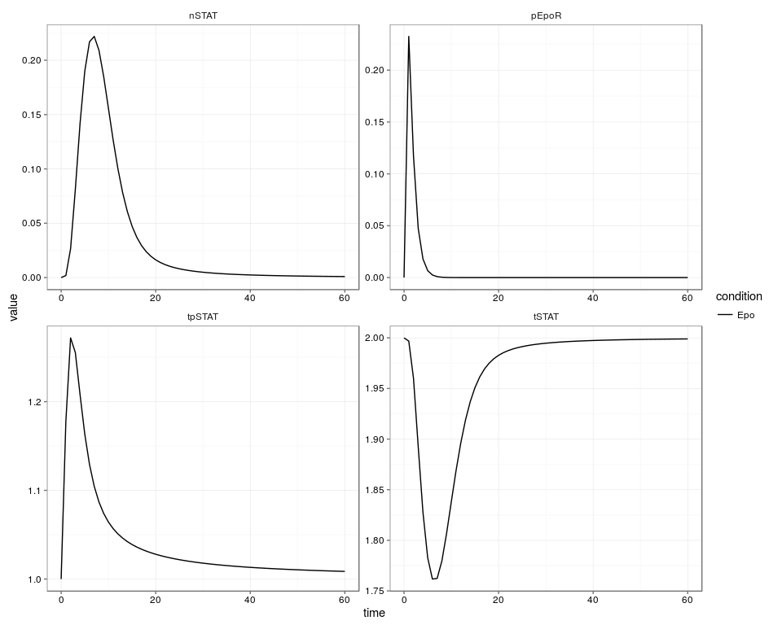
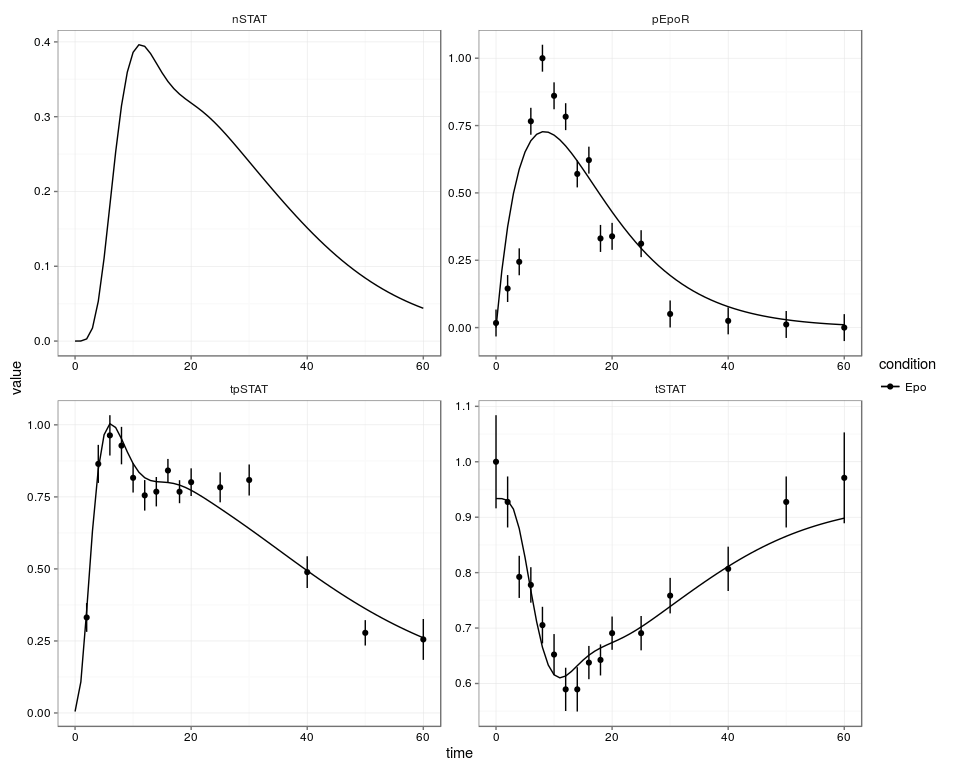
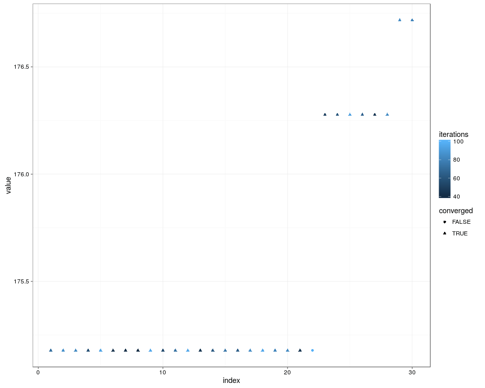
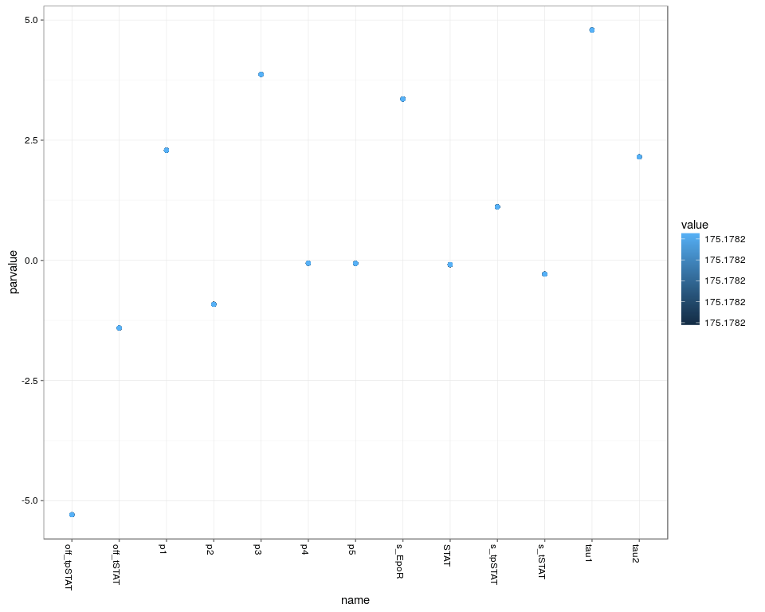
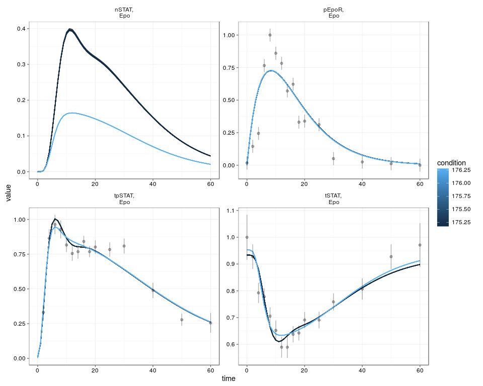
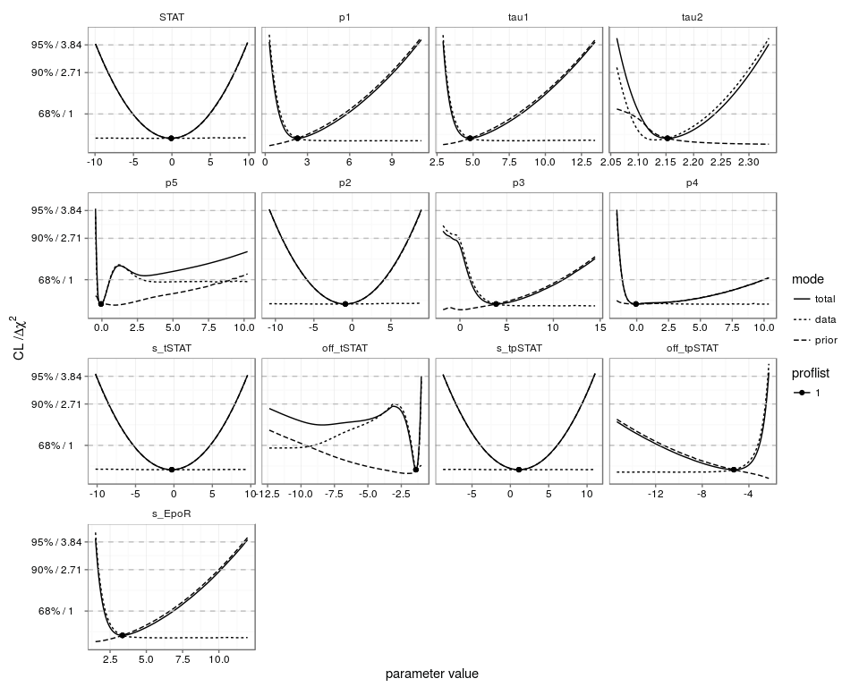
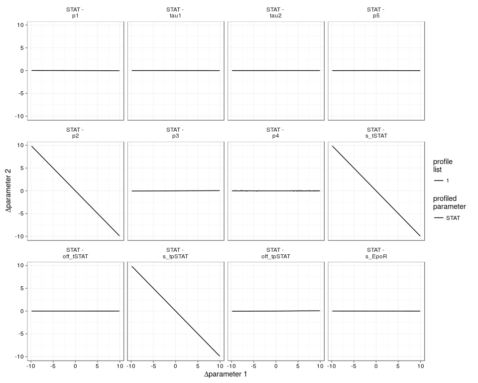
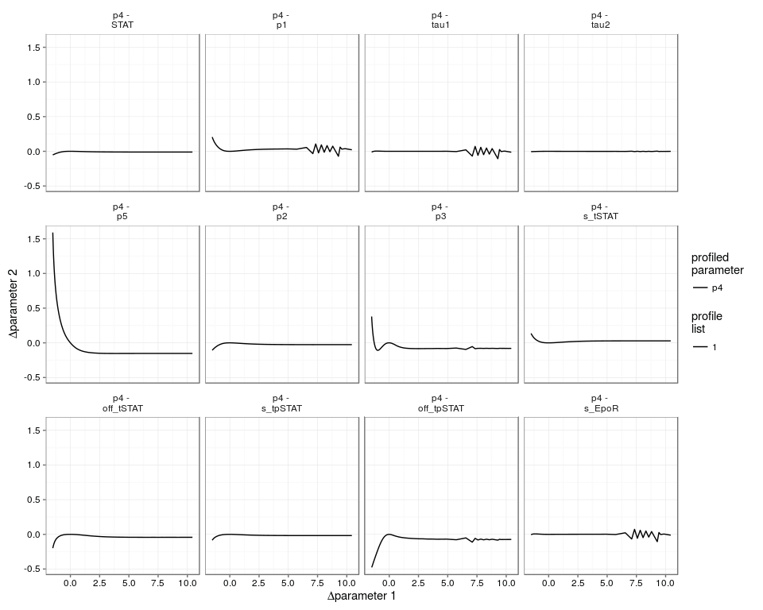

# Jak-Stat-Pathway
Daniel Kaschek  
March 15, 2016  


# Load framework


```r
library(deSolve)
library(dMod)
library(parallel)
```

# Set-up the model

## Model definition


```r
# Generate the ODE model
reactions <- as.eqnlist(read.csv("topology.csv"))

# Parameterize the receptor phosphorylation
reactions$rates <- replaceSymbols(
  what = "pEpoR", 
  by = "(1-exp(-time/tau1))*exp(-time/tau2)",
  x = reactions$rates
)

# ODE model and prediction function
fixed.zero <- setdiff(reactions$states, "STAT") # parameters that are not estimated
model0 <- odemodel(reactions, modelname = "jak-stat", compile = TRUE, 
                   fixed = fixed.zero, jacobian = "inz.lsodes")
x <- Xs(model0, optionsSens = list(method = "lsodes", rtol = 1e-6, atol = 1e-6))

# Define what we observe and generate the observation function
observables <- eqnvec(
  tSTAT = "s_tSTAT*(STAT + pSTAT + 2*pSTATdimer) + off_tSTAT",
  tpSTAT = "s_tpSTAT*(pSTAT + 2*pSTATdimer) + off_tpSTAT",
  pEpoR = "s_EpoR * (1-exp(-time/tau1))*exp(-time/tau2)",
  nSTAT = paste(reactions$states[grep("^n", reactions$states)], collapse = "+")
)

g <- Y(observables, reactions, modelname = "obsfn", compile = TRUE, attach.input = FALSE)
```


## Model parameterization


```r
# Initialize parameter transformation
innerpars <- union(attr(x, "parameters"), attr(g, "parameters"))
trafo <- as.eqnvec(innerpars, names = innerpars)

# Fix some initial values
trafo[fixed.zero] <- "0"

# Log-transform
trafo <- replaceSymbols(innerpars, paste0("exp(", innerpars, ")"), trafo)

p <- P(trafo, condition = "Epo")
```

## Model summary


```r
print(reactions, pander = TRUE)
```


-------------------------------------------------------------------------------------------------------------
Educt       ->   Product     Rate                                                        Description         
----------- ---- ----------- ----------------------------------------------------------- --------------------
STAT        ->   pSTAT       p1 * (1 - exp( - time / tau1)) * exp( - time / tau2) * STAT STAT phosphorylation

2 pSTAT     ->   pSTATdimer  p2 * pSTAT * pSTAT                                          pSTAT dimerization  

pSTATdimer  ->   npSTATdimer p3 * pSTATdimer                                             pSTAT dimer import  

npSTATdimer ->   2 nSTAT1    p4 * npSTATdimer                                            dimer dissociation  

nSTAT1      ->   nSTAT2      p5 * nSTAT1                                                 delay chain         

nSTAT2      ->   nSTAT3      p5 * nSTAT2                                                 delay chain         

nSTAT3      ->   nSTAT4      p5 * nSTAT3                                                 delay chain         

nSTAT4      ->   nSTAT5      p5 * nSTAT4                                                 delay chain         

nSTAT5      ->   STAT        p5 * nSTAT5                                                 STAT export         
-------------------------------------------------------------------------------------------------------------

```r
print(observables, pander = TRUE)
```


---------------------------------------------------------------------
   &nbsp;    &nbsp;                                                  
------------ --------------------------------------------------------
 **tSTAT**   s_tSTAT * (STAT + pSTAT + 2 * pSTATdimer) + off_tSTAT   

 **tpSTAT**  s_tpSTAT * (pSTAT + 2 * pSTATdimer) + off_tpSTAT        

 **pEpoR**   s_EpoR * (1 - exp( - time / tau1)) * exp( - time / tau2)

 **nSTAT**   npSTATdimer + nSTAT1 + nSTAT2 + nSTAT3 + nSTAT4 + nSTAT5
---------------------------------------------------------------------

```r
print(trafo, pander = TRUE)
```


---------------------------------
     &nbsp;       &nbsp;         
----------------- ---------------
    **STAT**      exp(STAT)      

    **pSTAT**     0              

 **pSTATdimer**   0              

 **npSTATdimer**  0              

   **nSTAT1**     0              

   **nSTAT2**     0              

   **nSTAT3**     0              

   **nSTAT4**     0              

   **nSTAT5**     0              

     **p1**       exp(p1)        

    **tau1**      exp(tau1)      

    **tau2**      exp(tau2)      

     **p5**       exp(p5)        

     **p2**       exp(p2)        

     **p3**       exp(p3)        

     **p4**       exp(p4)        

   **s_tSTAT**    exp(s_tSTAT)   

  **off_tSTAT**   exp(off_tSTAT) 

  **s_tpSTAT**    exp(s_tpSTAT)  

 **off_tpSTAT**   exp(off_tpSTAT)

   **s_EpoR**     exp(s_EpoR)    
---------------------------------


# Load data


```r
datasheet <- read.csv("pnas_data_original.csv")
data <- datalist(Epo = datasheet)
```


# Model prediction and parameter estimation


```r
# Initialize parameters
times <- 0:60
outerpars <- attr(p, "parameters")
center <- structure(rep(0, length(outerpars)), names = outerpars)

plot((g*x*p)(times, center))
```



```r
# Define objective functions
obj <- normL2(data, g*x*p)
regularize <- constraintL2(mu = center, sigma = 10)

myfit <- trust(obj + regularize,
               center, rinit = 1, rmax = 10)


plot((g*x*p)(times, myfit$argument), data)
```



```r
plot((x*p)(times, myfit$argument))
```


## Explore the parameter space by multistart fit


```r
set.seed(1)

out <- mstrust(obj + regularize, center = center, rinit = 1, fits = 50, cores = 4, sd = 3)

# Extract parameter frame of the best fits
parframe <- as.parframe(out)

# Visualize the different
plotValues(parframe[1:30,])
```



```r
plotPars(parframe[1:30,])
```



```r
plotArray(parframe[1:30, ], g*x*p, times, data = data)
```




## Analyze the model solution


```r
bestfit <- as.parvec(parframe)

profiles <- do.call(rbind, 
  mclapply(names(bestfit), function(n) {
    profile(normL2(data, g*x*p) + regularize,
            pars = bestfit,
            whichPar = n,
            limits = c(-10, 10)
    )},
    mc.cores = 4,
    mc.preschedule = FALSE
  )
)

# Visualize the fits
plotProfile(profiles)
```



```r
plotPaths(profiles, whichPar = "STAT")
```



```r
plotPaths(profiles, whichPar = "p4")
```




