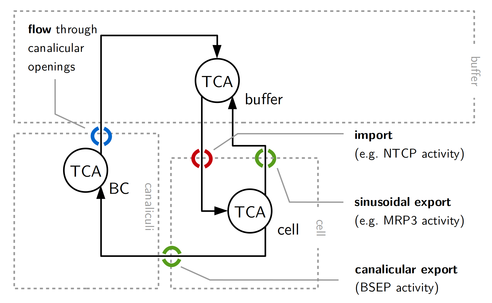

```{r setup, include=FALSE}
knitr::opts_chunk$set(echo = TRUE)
```

# Parameter Estimation in an ODE Model of Bile Acid Transport

## Preliminaries

Loading dMod and other packages

```{r, warning=FALSE, message=FALSE}

library(dMod)
library(dplyr)
library(ggplot2)
library(pander)
theme_set(theme_dMod())

```


## The model scheme




## Read the data

BAdata is a data frame with columns name (the name of the measured quantity), time (time coordinate), value (measurement coordinate), sigma (measurement uncertainty, not used if error model is defined), and additional columns characterizing the observed data point (denoted as covariates). 

```{r}

data(BAdata)
data <- BAdata %>% 
  filter(experiment == "exp1") %>%
  as.datalist()
covtable <- covariates(data)

```

The following table shows the first 10 lines of the BAdata:

```{r, echo = FALSE}
pander::pander(head(BAdata))
```

When the data is translated into dMod's `datalist` format, a unique condition identifier is constructed from all but the standard columns (name, time, value, sigma) by coercion. The translation table between condition identifier and covariate values can be accessed by the `covariates()` function. The result is shown in the table below.


```{r, echo = FALSE}
pander::pander(covtable)
```
 
The datalist object can readily be plotted:
```{r, fig.width=8, fig.height = 3}
plot(data)
```

## Setting up the base model

An ODE model in dMod is usally divided in three parts:

1. A prediction function based on the ODEs (takes times and parameters and returns the solution for the time points)
2. An observation function (takes the solution and evaluates an arbitrary function states and parameters)
3. The parameterization (a function that relates model parameters to a set of descriptive parameters)

### Setting up the prediction function

We start with writing up the elementary reactions, adding them step-by-step to a dMod `eqnlist` object.

```{r}

reactions <- eqnlist() %>%
 #addReaction(from, to, rate, description) %>%  
  addReaction("Tca_buffer", "Tca_cyto", "import_Tca*Tca_buffer", "Basolateral uptake") %>%
  addReaction("Tca_cyto", "Tca_buffer", "export_Tca_baso*Tca_cyto", "Basolateral efflux") %>%
  addReaction("Tca_cyto", "Tca_canalicular", "export_Tca_cana*Tca_cyto", "Canalicular efflux") %>%
  addReaction("Tca_canalicular", "Tca_buffer", "transport_Tca*Tca_canalicular", "Transport bile") %>%
  addReaction("0", "cations", "0", "Cation concentration in buffer")

```

The reactions can be printed and give an overview of the model.

```{r}
print(reactions, pander = TRUE)
```

The reactions are automatically translated to ODEs by the `as.eqnvec()` function. In our case, upon translating reactions to ODEs, we perform a replacement of every occurence of `transport_Tca` by an expression involving the cation state by means of the `define()` function which will be explained in more detail later.

```{r}
odes <- reactions %>% 
  as.eqnvec() %>% 
  define("transport_Tca  ~  (transport_Tca*crit/(crit + cations))")

```

For the first part of the presentation we have only selected data from experiment 1: Cells are incubated with TCA-containing buffer for 30 min. At t = 30 min, the buffer is replaced by TCA-free buffer. In experient 1, we find two conditions: (1) TCA-free buffer with calcium and (2) TCA-free buffer without calcium. The experimental set-up is translated into a list of events. The first two events desribed supply and removal of TCA. The third event determines at which time point calcium is removed:

```{r}
events <- eventlist() %>%
  #addEvent(var, time, value, method = "replace") %>%
  addEvent("Tca_buffer", "t_addTca", "amount_Tca") %>%
  addEvent("Tca_buffer", "t_removeTca", "0") %>%
  addEvent("cations", "t_removeCa", "0")

```

The model is made available as an R function in the workspace by a two-step procedure. First, the odes with the eventlist is translated into to C compiled model for which, in the second step, the prediction function is generated by the `Xs()` command.

```{r, fig.width=8, fig.height=4}

noSens <- c("t_removeCa", "t_addTca", "t_removeTca", "cations")
x <- odemodel(odes, events = events, fixed = noSens, modelname = "BA_basemodel") %>%
  Xs()

## Demonstration of the usage of x()
n <- getParameters(x)
pars <- runif(length(n), min = 0, max = 100)
names(pars) <- n

times <- 0:200
pred <- x(times, pars)
plot(pred) + theme(legend.position = "none")

```

### Setting up the observation function

The observation function is defined as a character, a parametric expression of the ODE states. By the `Y()` command, the observables are translated into a C compiled function. The `Y()` command needs to be informed about the prediction function to produce the correct list of derivatives.

Prediction and observation function can be concatenated, `g*x`, to evaluate the observation function on the prediction. 

```{r, fig.width=8, fig.height=3}
g <- eqnvec(buffer = "s*Tca_buffer",
            cellular = "s*(Tca_cyto + Tca_canalicular)") %>%
  Y(f = x, modelname = "obsfn", compile = TRUE)

# Demonstration of the usage of g
pars["s"] <- 1
pred <- (g*x)(times, pars)
plot(pred) + theme(legend.position = "none")

```

### Parameterization

With parameter estimation in mind, it is usually beneficial to choose a model parameterization that is different from the intrinsic parameterization of the model. In the next code section we will (1) fix some parameters to certain values (equality constraints), (2) fix some parameters in a condition-specific way, and (3) perform a general log-transform.

The names of the parameters involved in the prediction- and observation function are obtained by the `getParameters()` command. The `define()` command is used several times to replace, step by step, elements in the parameterization by numbers, functions or parametric expression. Finally, the equations are piped into the `P()` command to generate a parameter transformation **function**.

```{r}

parameters <- getParameters(g, x)
p <- eqnvec() %>%
  define("x ~ x", x = parameters) %>%
  define("x ~ 0", x = c("Tca_cyto", "Tca_canalicular", "Tca_buffer")) %>%
  define("cations ~ 1") %>%
  define("t_addTca ~ 0") %>%
  define("t_removeTca ~ 30") %>%
  branch(covtable) %>%
  define("t_removeCa ~ time", time = ifelse(changeCa == "yes", 30, 1e3)) %>%
  define("x ~ exp(X)", x = parameters, X = toupper(parameters)) %>%
  P()

```

## Parameter estimation

The parameter transformation function `p` contains the information about the "free" parameters, i.e. the parameters by which the system is parameterized. Parameter estimation is going to be initialized by random numbers. The corresponding model prediction in relation to the data is shown in the plot.

```{r, fig.width = 8}
set.seed(12837)
estimate <- getParameters(p)
pars <- structure(runif(length(estimate), min = -2, max = 0), names = estimate)
times <- seq(0, 200, 1)
(g*x*p)(times, pars) %>% plot(data = data, time <= 180)

```

In order to estimate the parameters, an objective function is generated from the data and the prediction function `g*x*p` by `normL2()`. A general quadratic prior is added for all parameters to facilitate parameter estimation. Finally, the objective function is minimized by the `trust()` function.

```{r, fig.width=8}

obj <- normL2(data, g*x*p) + constraintL2(0*pars, sigma = 10)
myfit <- trust(obj, pars, rinit = 1, rmax = 10, iterlim = 500)

(g*x*p)(times, myfit$argument) %>% plot(data = data, time <= 180)
```

### Identifiability

```{r, fig.width = 8, fig.height = 5}
profiles <- profile(obj, myfit$argument, names(myfit$argument), cores = 4)
profiles %>% plotProfile(mode == "data")


```


```{r, fig.width = 8, fig.height = 4}

# Add additional data
data$exp1_yes_no_0 <- data$exp1_yes_no_0 %>%
  rbind(data.frame(name = "Tca_buffer", time = 1, value = 21.5, sigma = 2))

obj <- normL2(data, g*x*p) + constraintL2(0*pars, sigma = 10)
myfit <- trust(obj, pars, rinit = 1, rmax = 10, iterlim = 500)

pred <- (g*x*p)(times, myfit$argument) 
pred %>% plot(data = data, name %in% c("buffer", "cellular", "Tca_buffer"))

```

```{r, fig.width = 8, fig.height = 4}

profiles <- profile(obj, myfit$argument, c("S", "AMOUNT_TCA"), cores = 2)
profiles %>% plotProfile(mode == "data")

```

```{r, fig.width = 8, fig.height = 4}

# Explore parameter space
fits <- mstrust(obj, pars, fits = 30, rinit = 1, rmax = 10, samplefun = "runif", min = -5, max = 5, cores = 4)
parframe <- as.parframe(fits)
plotValues(parframe[1:28,])
plotPars(parframe[1:28,])
subframe <- unique(parframe[1:28,])

prediction <- predict(g*x*p, times = times, pars = subframe, data = data)

ggplot(prediction, aes(x = time, y = value, color = as.factor(round(.value)))) + facet_wrap( ~ name*changeCa, scales = "free") +
  geom_line() +
  geom_point(data = as.data.frame(data), color = "black") +
  scale_color_discrete(name = "obj. value")

```

```{r, fig.width = 8, fig.height = 6}

profiles <- lapply(1:nrow(subframe), function(i) {
  profile(obj, as.parvec(subframe, i), names(myfit$argument), limits = c(-4, 4), cores = 4)
})
names(profiles) <- c("obj = 23", "obj = 24", "obj = 27")
profiles %>% plotProfile(mode == "data")

```

```{r}

partable <- confint(profiles[[1]], level = 0.9, val.column = "value")

pander(partable)

# Save objects from this session
save.image(file = "part1.RData")

  
```

