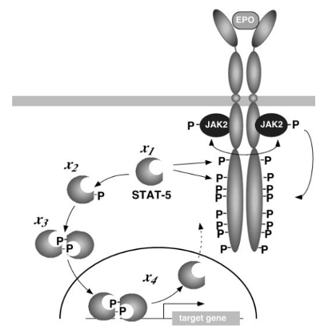

# Example 1: The JAK-STAT signaling pathway

The JAK-STAT pathway is a typical intracellular signal transduction pathway. The JAK2 protein located at the Epo receptor gets phosphorylated as soon as Epo binds to the receptor. A cascade via STAT5 phosphorylation, dimerization, internalizaton into the nucleus and export of the unphosphorylated STAT5 begins. The mathematical model and experimental data upon which this vignette is based is published in Swameye et. al, *Identification of nucleocytoplasmic cycling as a remote sensor in cellular signaling by data-based modeling*,  Proc. Natl. Acad. Sci., 2003.




```{r setup, include=FALSE}
knitr::opts_chunk$set(echo = TRUE, fig.width = 10, fig.height = 8, warning = FALSE, message = FALSE)
```


## Load framework

```{r}
library(dMod)
library(dplyr)
set.seed(2)
```

dMod will generate C files and compiled output in the current working directory. If you want to keep your current directory clean, consider setting the working directory to a temporary folder before you continue: `setwd(tempdir())`.

## Prediction and forward simulation

### Model definition

Within `dMod`, models are typically defined in a tabular or by a sequence of `addReaction` commands. The model for the JAK-STAT pathway is defined reaction by reaction in the following code chunk. 

```{r}
# Generate the ODE model
r <- eqnlist() %>% 
  addReaction("STAT"       , "pSTAT"      , "p1*pEpoR*STAT" , "STAT phosphoyrl.") %>%
  addReaction("2*pSTAT"    , "pSTATdimer" , "p2*pSTAT^2"    , "pSTAT dimerization") %>%
  addReaction("pSTATdimer" , "npSTATdimer", "p3*pSTATdimer" , "pSTAT dimer import") %>%
  addReaction("npSTATdimer", "2*nSTAT"    , "p4*npSTATdimer", "dimer dissociation") %>%
  addReaction("nSTAT"      , "STAT"       , "p5*nSTAT"      , "nuclear export")

print(r)
```

The first reaction contains the phosphorylated Epo-receptor which is not modeled mechanistically but should be replaced by an algebraic function that can describe the activation of the receptor. Therefore, we replace `pEpoR` in the rates:

```{r}
# Parameterize the receptor phosphorylation
receptor <- "((1 - exp(-time*lambda1))*exp(-time*lambda2))^3"
r$rates <- r$rates %>% 
  insert("pEpoR ~ pEpoR*rec", rec = receptor)

```

Next, the equation list representing the ODE is translated into the ODE model `model0`. The function calls `as.eqnvec()` to generate the vector of (ordinary differential) equations, translates them into C code, derives sensitivity equations, etc. Integrating sensitivity equations can increase the integration time. Therefore, it is recommended to tell `odemodel()` which of the parameters will take fixed values and will not be estimated based on experimental data.

```{r}
# Generate odemodel
model0 <- odemodel(r, modelname = "jakstat", compile = TRUE)
```

### Prediction and observation functions

The object `model0` is needed to define a prediction function, i.e. a function that turns time points and parameter values into a prediction of the model states. 

```{r, fig.width = 6, fig.height = 4}
# Generate a prediction function
x <- Xs(model0)

# Make a prediction based on random parameter values
parameters <- getParameters(x)
pars <- structure(runif(length(parameters), 0, 1), names = parameters)
times <- seq(0, 10, len = 100)
prediction <- x(times, pars)
plot(prediction)

```

Frequently, the ODE states cannot be directly observed in an experiment. Instead, quantities defined by an observation function are measured. Observables can be defined as equation vectors. Finally, an observation function is created, i.e. a function that turns a model prediction and parameter values (e.g. for observation parameters) into a prediction of the observables.

```{r}
# Define observables like total STAT, total phosphorylated STAT, etc.
observables <- eqnvec(
  tSTAT = "s_tSTAT*(STAT + pSTAT + 2*pSTATdimer)",
  tpSTAT = "s_tpSTAT*(pSTAT + 2*pSTATdimer) + off_tpSTAT",
  pEpoR = paste0("s_EpoR * pEpoR *", receptor)
)

# Define the observation function. Information about states and dynamic parameters
# is contained in reactions
g <- Y(observables, r, modelname = "obsfn", compile = TRUE, attach.input = FALSE)
```

To predict the observables, observation and prediction function need to be concatenated. What mathematically looks like $(g\circ x)(t, p)$ is translated into code using the `*` operator.

```{r, fig.width = 6, fig.height = 2.5}
# Make a prediction of the observables based on random parameter values
parameters <- getParameters(x, g)
pars <- structure(runif(length(parameters), 0, 1), names = parameters)
times <- seq(0, 10, len = 100)
prediction <- (g*x)(times, pars)
plot(prediction)
```

### Parameter transformations

Parameter transformations can for example be used to fix initial values or perform a log-transform. The basic object is again an equation vector containing the equations which express the inner model parameters as functions of other parameters. The names of the other parameters can coincide with the inner parameters.

```{r}

p <- eqnvec() %>% 
  # Start with the identity transformation
  define("x~x", x = getParameters(x, g)) %>% 
  # Fix some initial values
  define("x~0", x = c("pSTAT", "pSTATdimer", "npSTATdimer", "nSTAT")) %>% 
  # Log-transform all current symbols found in the equations
  insert("x~exp(x)", x = .currentSymbols) %>% 
  # Generate parameter transformation function
  P(condition = "Epo")

print(getEquations(p))


```

For many models, different experimental conditions can be expressed as different parameterizations of the same underlying model. This is illustrated by introducing a new condition `Epo prediction` which we will use to predict the model response for an EpoR signal that is a multiple of the measured signal. Parameter transformation functions for different conditions can be collected by the `+` operator (the same holds for prediction and observation functions):

```{r}

# Add another parameter transformation
p <- p +
  # Start with the current transformation
  getEquations(p, conditions = "Epo") %>%
  # Insert multiple of pEpoR everywhere where we finde pEpoR
  define("pEpoR ~ multiple*exp(pEpoR)") %>% 
  # Generate parameter transformation function with another condition name
  P(condition = "Epo prediction")

print(getEquations(p))

```

Now we can generate predictions based on random parameters for the two conditions. Again, all functions are concatenated by the `*` operator. 

```{r, fig.width = 6, fig.height = 2.5}
# Make a prediction of the observables based on random parameter values
parameters <- getParameters(p)
pars <- structure(runif(length(parameters), 0, 1), names = parameters)
pars["multiple"] <- 2
times <- seq(0, 10, len = 100)
prediction <- (g*x*p)(times, pars)
plot(prediction)
```


## Parameter estimation

### Preparing the data

Model predictions are organized in lists where the elements correspond to different conditions. This concept is copied for the organization of data. We assume that the data comes in data frames which give us information about the name of the observable, the measurement time, the measured value, the uncertainty of the value and one or several columns specifying the experimental conditions.

This data frame is converted into a data list that can readily be plotted:

```{r, fig.width = 6, fig.height = 2}
data(jakstat)
data <- as.datalist(jakstat, split.by = "condition")
plot(data)
```

### Objective function

Parameter estimation by dMod is based on weighted least squares estimation. This is, we minimize the objective function
\[ \chi^2(p) = \left\| \frac{{\rm data} - {\rm prediction}}{ {\rm uncertainty}} \right\|^2 \]
where $\|x\| = \sqrt{\sum x_i^2}$ denotes the usual $L_2$ norm.

An objective function of this form is generated by `normL2` based on the data list and a prediction function:

```{r}
obj <- normL2(data, g*x*p)
```

This objective function takes parameters and computes the $\chi^2$ value, its gradient $\nabla\chi^2$ and its Hessian matrix $H\chi^2$. This output is returned in a list for optimization via the `trust` optimizer. 

### Fitting the data

Frequently, the measured data is not sufficient to guarantee a unique optimum of the objective function. In many cases, parameters even diverge during optimization and the objective function cannot be computed any more because the intergrator gives up. To prevent this, we support two strategies.

1. Parameters can be restricted to a box via a parameter transformation, e.g. by the `atan` function. Indeed, we already have restricted our parameters to take positive values by the exponential transformation.
2. The objective function can be regularized by a quadratic constraint function, also known as a prior.

Here, we follow the second option defining a constraint function:

```{r}
mu <- structure(rep(0, length(parameters) - 1), names = setdiff(parameters, "multiple"))
fixed <- c(multiple = 2)
constr <- constraintL2(mu = mu, sigma = 5)
```

Finally, we fit the model to the data by means of the trust region optimizer and look at the result.

```{r, fig.width = 6, fig.height = 2}

myfit <- trust(obj + constr, mu, rinit = 1, rmax = 10, fixed = fixed)
times <- 0:60
plot((g*x*p)(times, myfit$argument, fixed = fixed), data)

```

### Exporing the parameter space

Sometimes, the system has many local optima. A single fit converges to a neighboring optimum and we would like to spread the initial positions of optimization throughout the parameter space. This procedure is implemented in the multi-start trust procedure `mstrust()`:

```{r, fig.width = 5, fig.height = 4}

fitlist <- mstrust(obj + constr, 
                   center = myfit$argument, 
                   fits = 20, 
                   cores = 1, 
                   sd = 2, 
                   fixed = fixed, conditions = "Epo")

pars <- as.parframe(fitlist)
plotValues(pars, tol = .1)
plotPars(pars, tol = .1)

```

In our case we find several local optima in the proximity of the original fit. Solutions for a parameter frame can be simulated by the `predict()` function. To see both, internal states and observables, the controls of `g` are changed via the `controls()` function.

```{r, fig.width = 10, fig.height = 3.5}

controls(g, NULL, "attach.input") <- TRUE
prediction <- predict(g*x*p, 
                      times = 0:60, 
                      pars = unique(pars[pars$converged, ], tol = .1), 
                      data = data, 
                      fixed = c(multiple = 2))

library(ggplot2)
ggplot(prediction, aes(x = time, y = value, color = .value, group = .value)) +
  facet_grid(condition~name, scales = "free") +
  geom_line() + 
  geom_point(data = attr(prediction, "data")) +
  theme_dMod()


```


### Identifiability analysis by the profile likelihood method

Next, we might be interested if the parameters we get out are identifiable. Therefore, we compute so-called likelihood profile for each parameter. The profile likelihood for the $i^{\rm th}$ parameter is defined as the optimimum of the following objective function
\[\tilde\chi^2_i (p, \lambda, c) = \chi^2(p) + \lambda(p_i - c), \]
i.e. the optimum over all parameters satisfying the constraint $p_i = c$.

```{r, fig.width = 4, fig.height = 3}

myprofile <- profile(obj + constr, pars = myfit$argument, whichPar = "s_EpoR", fixed = fixed)
plotProfile(myprofile)

```

The profile indicates that the parameter `s_EpoR` is entirely determined by the prior. The data contribution is constant over orders of magnitude. The reason for this is revealed by the parameter paths, i.e. the trace in parameter space 

```{r, fig.width = 6, fig.height = 5}

plotPaths(myprofile)

```

The parameters `s_EpoR`, `p1` and `pEpoR` compensate each other. This non-identifiability is resolved by fixing two of the three paramters, e.g. `p1 = pEpoR = 1`. 

```{r, fig.width = 4, fig.height = 3}

fixed <- c(p1 = 0, pEpoR = 0, multiple = 2) # log values
pars <- mu[setdiff(names(mu), names(fixed))]
myfit <- trust(obj + constr, pars, rinit = 1, rmax = 10, fixed = fixed)
myprofile <- profile(obj + constr, pars = myfit$argument, whichPar = "s_EpoR", fixed = fixed)

plotProfile(myprofile)

```

Now, the situation is reversed. The parameter `s_EpoR` is fully determined by the data and the influence of the prior is low.
