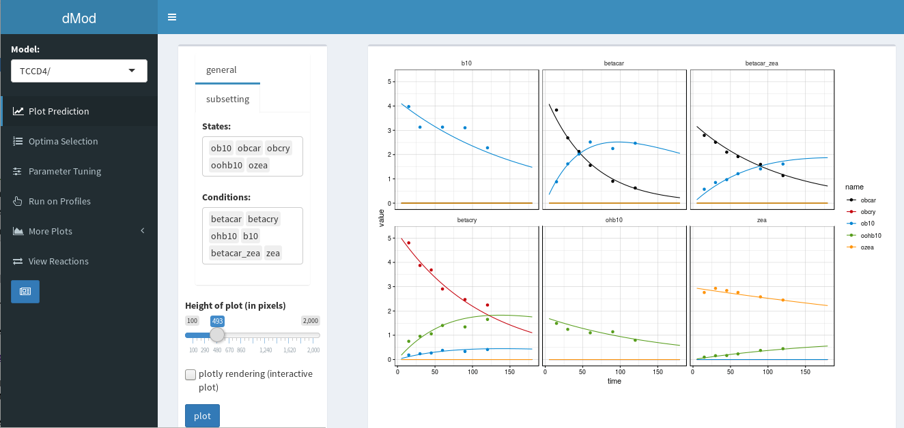

```{r setup, include=FALSE}
knitr::opts_chunk$set(echo = TRUE, fig.width = 7, fig.height = 3.5)
```

You might want to interactively browse through your results and share this view with your colleagues. A nice way to do so is via a shiny web app, see <https://shiny.rstudio.com/>.

Check out a customized shiny app for showing your modelling results obtained with dMod at   <http://fermi.fdm.uni-freiburg.de:3838/mfehling/dModtoShinyPub/>.




##Contents of the app

The main input to the app is a list of objects (a list of fits generated with `mstrust`, data, the prediction function, parameter profiles, list of reactions) or a `dMod.frame`. Implemented features include the standard dMod plots:

* *Plot Prediction*: based on `plotCombined` to plot the prediction and data for chosen time interval, conditions and states (subsetting tab) for different options (general tab, e.g. log-axis). By default only the best/global optimum is plotted but you can choose more optima on the next tab *Optima Selection*.
* *Optima selection*: calls `plotValues` and optionally `plotPars`. Allows to choose several optima to be shown in other tabs, e.g. *Plot Prediction* and *Residuals* and to export the parameter values from one optimum to the *Parameter Tuning* tab.
* *Parameter Tuning*: see how the prediction changes when changing parameter values. All parameter values can be changed and the new prediction is shown as solid line, while the original prediction is shown as dashed line. Optionally, the change of the fluxes can be viewed instead. 
* *Run on Profiles*: includes several options regarding the parameter profiles. Calls `plotProfiles` (click Plot profiles) or `plotPath` (switch to Path tab above the plot), or change the parameters along one choosen profile and plot the corresponding prediction (see Choose profile in the left panel).
* *More Plots*: contains two options:
    + *Fluxes*: calls `plotFluxes`, choose from fluxes predefined by the model and/or type your own flux-equations
    + *Residuals*: calls `plotResiduals`, choose from several options to summarise the residuals

* *View Reactions*: print model reactions in tabular format
* Optinal link to paper if results are published


## Run the app locally
```{r, message = FALSE, eval=FALSE}
# in case you don't have those packages installed already, install:
install.packages("shiny")
install.packages("shinycssloaders")
install.packages("shinyjs")
install.packages("shinydashboard")
```

The app (*app.R*) and one example model can be found in the *inst/examples/dModtoShiny* folder. Run the shiny app locally on your machine:

```{r, message = FALSE, eval=FALSE}
library(dMod)
library(shiny)

setwd(paste0(system.file(package = "dMod"),'/examples/dModtoShiny/'))

runApp()

```

The app reads in models from all subfolders within the app folder dModtoShiny (in this case there is only one model *CCD4*). The app might not run using the input of the existing folder since it contains compiled code. In this case you need rebuild the contents of the CCD4 folder:

```{r, message = FALSE, eval=FALSE}
library(dMod)

setwd(paste0(system.file(package = "dMod"),'/examples/dModtoShiny/CCD4'))
source(paste0(system.file(package = "dMod"),'/examples/example_CCD4/setup.R'))
myprofiles <- readRDS(paste0(system.file(package = "dMod"),'/examples/example_CCD4/profiles.Rds'))
testtrust <- readRDS(paste0(system.file(package = "dMod"),'/examples/example_CCD4/mstrust_CCD4.Rds'))

saveShiny <- function(reactions, 
                      x, 
                      parameters, 
                      fixed = NULL, 
                      data, 
                      profiles, 
                      pubref="none", 
                      errmodel = NULL){
  save(reactions, x, fixed, data, parameters, profiles, pubref, file = "input_shiny.RData")
}

saveShiny(x = g*x*p, parameters = testtrust, data = data, reactions = f, profiles = myprofiles, pubref = "https://www.ncbi.nlm.nih.gov/pubmed/27811075")

setwd(paste0(system.file(package = "dMod"),'/examples/dModtoShiny/'))

runApp()

```

Add more models by adding one subfolder per model. The necessary input needs to be stored in a file called *input_shiny.RData* which can be generated by the `saveShiny` function shown above. In addition to the .RData file, corresponding .so files need to be copied to the model subfolder. Easier exports are work in progress (see input_shiny.R for a preliminary export using the dMod.frame). Remark: it is currently not possible to add different setups of the same model (e.g. different parameterization) in one folder, but you can add a folder for each setup.

To customize the app, modify *app.R*. 

## Make the app a web app

To share the app on the web you have several options: <https://shiny.rstudio.com/articles/deployment-web.html>.

In case you have a Linux server available, we recommend installing a shiny server <https://www.rstudio.com/products/shiny/download-server/>. 
